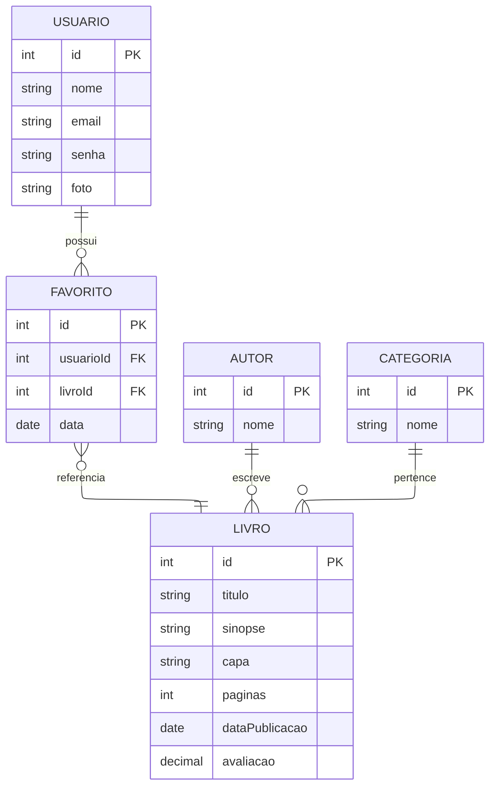

# 🛠️ Especificação Técnica (Tech Spec) - LoreShelf

Este documento detalha a arquitetura técnica, o modelo de dados e os contratos de API necessários para o funcionamento do sistema LoreShelf.

1. Modelo de Dados (Diagrama ER)

O LoreShelf possui uma estrutura de dados simplificada. Os livros são obtidos dinamicamente através da Open Library API, enquanto os identificadores dos livros favoritados são armazenados localmente utilizando a Web Storage API (localStorage).

O sistema não necessita de cadastro, login ou banco de dados próprio para o funcionamento do MVP.

As principais informações utilizadas pela aplicação são:

LIVRO: representa uma obra obtida através da API pública.
FAVORITO: representa a identificação de um livro salvo pelo usuário em sua biblioteca local.

Abaixo está o Diagrama Entidade-Relacionamento (DER) que representa a estrutura do nosso "banco de dados" (`db.json`) e como as informações se conectam.



## 2. Dicionário de Dados

**Livros:** Os dados são obtidos dinamicamente através da Open Library API. A aplicação utiliza as informações retornadas pela API para montar os cards e a página de detalhes.
 - id: Identificador único da obra fornecido pela API.
 - titulo: Nome do livro.
 - autor: Nome do autor ou autores.
 - sinopse: Descrição ou resumo da obra, quando disponível.
 - capa: URL utilizada para carregar a capa do livro.
 - paginas: Número de páginas da obra, quando disponível.
 - dataPublicacao: Ano ou data de publicação.
 - idioma: Idioma associado à obra.
**Favoritos:** Armazena localmente os livros selecionados pelo usuário.
 - livroId: Identificador utilizado para encontrar novamente o livro através da API.
 - data: Data em que o livro foi favoritado.

Regra de Negócio: Um mesmo livro não deve ser adicionado mais de uma vez aos favoritos. Ao tentar favoritar uma obra que já está na biblioteca, o sistema deve manter apenas uma ocorrência.

## 3 Tecnologias:

**APIs** 
 - Open Library API - Version 5b92e77

**Framework**
 - Bootstrap - Version 5.3.8 

## 4. Rotas da API (JSON Server)

A aplicação consome a API local simulada pelo JSON Server. Abaixo os principais endpoints:

- `GET /usuarios` - Retorna a lista de usuários.
- `POST /usuarios` - Cadastra um novo usuário.
- `GET /transacoes?id_usuario=1` - Retorna o extrato de um usuário específico.

## 5. Estrutura do Banco de Dados (db.json)

Esta é a representação em formato JSON do banco de dados simulado. Esta estrutura serve de contexto para ferramentas de IA e para o JSON Server inicializar a API Fake.

```JSON
{
    "clientes": [
    {
        "id": "1",
        "nome": "João da Silva",
        "cpf": "12345678900",
        "senha": "senha_super_segura",
        "saldo": 850.50
    }],
    "transacoes": [
    {
        "id": "1",
        "clienteId": "1",
        "tipo": "DEPOSITO",
        "valor": 1000.00,
        "data": "2026-03-16",
        "descricao": "Depósito inicial em espécie"
    },
    {
        "id": "2",
        "clienteId": "1",
        "tipo": "TAXA",
        "valor": 50.00,
        "data": "2026-03-16",
        "descricao": "Taxa de boas-vindas do Roubank"
    },
    {
        "id": "3",
        "clienteId": "1",
        "tipo": "SAQUE",
        "valor": 99.50,
        "data": "2026-03-17",
        "descricao": "Saque no caixa eletrônico"
    }]
}
```
